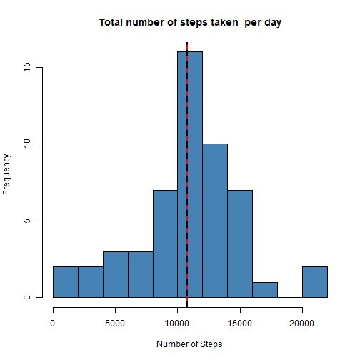
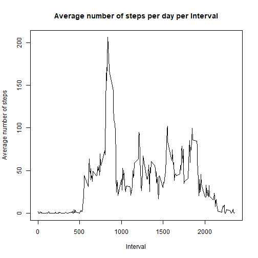
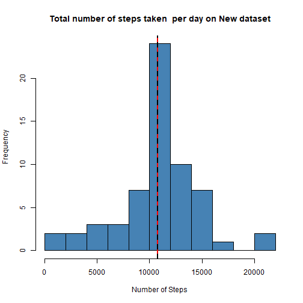
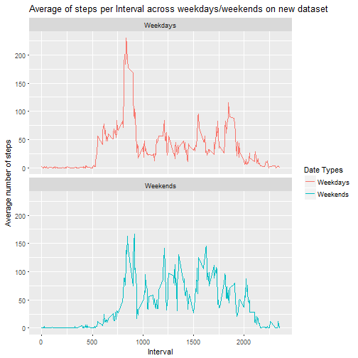

Reproducible Research: Project 1
========================

*Author: Neha Patil*  
*Date: February 15, 2018*


##Data 

The data for this assignment was downloaded from the course web site:  

* Data set: [Activity monitoring data](https://d396qusza40orc.cloudfront.net/repdata%2Fdata%2Factivity.zip)  

The variables included in this dataset are:

* **steps**: Number of steps taking in a 5-minute interval (missing values are coded as NA)  
* **date**: The date on which the measurement was taken in YYYY-MM-DD format  
* **interval**: Identifier for the 5-minute interval in which measurement was taken  

The dataset is stored in a comma-separated-value (CSV) file and there are a total of 17,568 observations in this dataset.  
The dataset for this assignment is also present in the github repository. 

## Loading and preprocessing the data

We can set the working directory (where we want to store the data and R code) by using function `setwd()`.  


```r
library(knitr)
opts_chunk$set(echo = TRUE, cache= FALSE)
```


This step will create a folder in current working directory where we will download and unzip the data so that we can load it in the data frame **`activitydata`**:  


```r
if(!file.exists("ReproducibleData")){
  dir.create("ReproducibleData")
}

download.file("https://d396qusza40orc.cloudfront.net/repdata%2Fdata%2Factivity.zip", "./ReproducibleData/repdataactivity.zip")

# unzip zip file containing data if data directory doesn't already exists
uzp <- "./ReproducibleData/repdataactivity.zip"
unzip(uzp, exdir = "./ReproducibleData")

setwd("./ReproducibleData")
dir()
```

```
## [1] "activity.csv"        "repdataactivity.zip"
```

```r
activitydata <- read.csv("activity.csv", stringsAsFactors = TRUE)
dim(activitydata)
```

```
## [1] 17568     3
```

```r
summary(activitydata) # Has 2304 NA records in the dataset (13% of the dataset)
```

```
##      steps                date          interval     
##  Min.   :  0.00   2012-10-01:  288   Min.   :   0.0  
##  1st Qu.:  0.00   2012-10-02:  288   1st Qu.: 588.8  
##  Median :  0.00   2012-10-03:  288   Median :1177.5  
##  Mean   : 37.38   2012-10-04:  288   Mean   :1177.5  
##  3rd Qu.: 12.00   2012-10-05:  288   3rd Qu.:1766.2  
##  Max.   :806.00   2012-10-06:  288   Max.   :2355.0  
##  NA's   :2304     (Other)   :15840
```

Here, we are processing the dataset and storing the cleaned data in dataframe **`activity`**:


```r
activity <- activitydata[!is.na(activitydata$steps),] #Removed the 2304 rows of NA which was 13% of the dataset
head(activity)
```

```
##     steps       date interval
## 289     0 2012-10-02        0
## 290     0 2012-10-02        5
## 291     0 2012-10-02       10
## 292     0 2012-10-02       15
## 293     0 2012-10-02       20
## 294     0 2012-10-02       25
```

```r
dim(activity)
```

```
## [1] 15264     3
```

```r
str(activity)
```

```
## 'data.frame':	15264 obs. of  3 variables:
##  $ steps   : int  0 0 0 0 0 0 0 0 0 0 ...
##  $ date    : Factor w/ 61 levels "2012-10-01","2012-10-02",..: 2 2 2 2 2 2 2 2 2 2 ...
##  $ interval: int  0 5 10 15 20 25 30 35 40 45 ...
```

```r
# Converting the Date from Factor type to Date type
activity$date <- as.Date(activity$date)
```


## What is mean total number of steps taken per day?

We are calculating and creating the Histogram of the total number of steps taken  per day. Also taking the mean and median of the total number of steps taken per day and presenting the same in histogram:  


```r
# Total number of steps taen per day 
Total_step <- aggregate(activity$steps ~ activity$date, FUN=sum)
colnames(Total_step) <- c("Date", "Steps")
head(Total_step)
```

```
##         Date Steps
## 1 2012-10-02   126
## 2 2012-10-03 11352
## 3 2012-10-04 12116
## 4 2012-10-05 13294
## 5 2012-10-06 15420
## 6 2012-10-07 11015
```

```r
avg =mean(Total_step$Steps)
med= median(Total_step$Steps) 

# Creating the histogram on the above data of Total steps, mean and median of the total steps
hist(Total_step$Steps, breaks = 10, col ="steel blue", main = paste("Total number of steps taken  per day"), xlab = "Number of Steps")
abline(v = avg, col= "red", lty = 1, lwd=2)
abline(v= med, col = "black", lty = 2, lwd=2)
```



```r
# Mean and median are very close to each other that is why the two lines in the diagram are overlapping
```

The mean of the total number of steps taken per day is 10766 and median is 10765.  


## What is the average daily activity pattern?

We are calculating the average number of steps (across all the days) for each intervals and then plotting the line diagram for the same.  


```r
Avg_step <- aggregate(activity$steps~activity$interval, FUN = mean)
colnames(Avg_step) <- c("Interval", "Steps")
head(Avg_step)
```

```
##   Interval     Steps
## 1        0 1.7169811
## 2        5 0.3396226
## 3       10 0.1320755
## 4       15 0.1509434
## 5       20 0.0754717
## 6       25 2.0943396
```

```r
# plotting the time series (type= "l") of the 5-minute interval (x-axis) and the average number of steps taken, averaged across all days (y-axis)
with(Avg_step, plot(Interval,Steps, type= "l", main= "Average number of steps per day per Interval", xlab = "Interval", ylab = "Average number of steps" ))
```



```r
# finding the maximum number of steps in 5 minute interval
max= Avg_step[which.max(Avg_step$Steps),1]
```

The 5-minute interval, on average across all the days in the dataset, containing the maximum number of steps as 835.  


##Imputing missing values

We are calculating and reporting the total number of NA's present in the raw data **`activitydata`**.  


```r
total_na <- nrow(activitydata[is.na(activitydata$steps),])
```

The total number of NA's present in the raw data **`activitydata`** is 2304 and total percentage of the missing data in dataset is 13.  

We will be following a strategy for filling in all of the 2304 missing values in the dataset. Here, we are going to take the mean of number of steps (across all days) for each 5-minute interval and then replace the missing data of that interval with the respective mean. For which we are creating a new variable as **`Steps_Interval`** which will have the details of the mean of number of stesp (across all days) for each 5-minute interval and a list **`activity.split`** having the dataframe grouped and split into different intervals.  


```r
# First we are getting the mean of the number of steps with respect to each interval
Steps_Interval <- tapply(activitydata$steps, activitydata$interval, mean, na.rm = TRUE)

# split activity data by interval
activity.split <- split(activitydata, activitydata$interval)

# filling the missing data for each interval with the mean of each interval
for(i in 1:length(activity.split)){
  activity.split[[i]]$steps[is.na(activity.split[[i]]$steps)] <- Steps_Interval[i]
}

#combining the data back into a single dataframe where the NA data's are replaced with the mean of number of steps w.r.t each interval
imputeddata <- do.call("rbind", activity.split)
imputeddata$date <-as.Date(imputeddata$date)

# verifying if there is no more NA's available in the new dataset
mean(is.na(imputeddata))
```

```
## [1] 0
```

Now, we are recalculating the total number of steps taken each day, mean and median on that total number of steps taken each day on the new data set **`imputeddata`**


```r
imputed.steptotal <- aggregate(imputeddata$steps ~ imputeddata$date, FUN=sum)
colnames(imputed.steptotal) <- c("Date", "Steps")
head(imputed.steptotal)
```

```
##         Date    Steps
## 1 2012-10-01 10766.19
## 2 2012-10-02   126.00
## 3 2012-10-03 11352.00
## 4 2012-10-04 12116.00
## 5 2012-10-05 13294.00
## 6 2012-10-06 15420.00
```

```r
avg_new =mean(imputed.steptotal$Steps)
med_new= median(imputed.steptotal$Steps) 

# Creating the histogram on the above data of Total steps, mean and median of the total steps on new data set
hist(imputed.steptotal$Steps, breaks = 10, col ="steel blue", main = paste("Total number of steps taken  per day on New dataset"), xlab = "Number of Steps")
abline(v = avg_new, col= "red", lty = 1, lwd=2)
abline(v= med_new, col = "black", lty = 2, lwd=2)
```



```r
# Mean and median are same that is why the two lines in the diagram are overlapping
```

The mean of the total number of steps taken per day on the new dataset is 10766 and median is 10766.  

By filling up the NA data's in the raw dataset with the mean of the number of steps w.r.t the intervals, we see that the median of the dataset is changed and is now equal to mean.

## Are there differences in activity patterns between weekdays and weekends?

For this we are creating two new variables. One to define the days w.r.t the dates of the **`imputeddata`** and other defines whether the day is Weekdays or Weekend.  

Please note: we have taken "Saturdays" and "Sundays" as Weekend.  

Once we get the final dataset of **`imputeddata`**, then we will make a panel plot containing a time series plot (i.e. type = "l") of the 5-minute interval (x-axis) and the average number of steps taken, averaged across all weekday days or weekend days (y-axis)


```r
library("dplyr")
library("ggplot2")
imputeddata$days <- weekdays(imputeddata$date)
imputeddata <-imputeddata %>% mutate(dow = ifelse(days %in% c("Saturday", "Sunday"), "Weekends", "Weekdays"))
head(imputeddata)
```

```
##       steps       date interval      days      dow
## 1  1.716981 2012-10-01        0    Monday Weekdays
## 2  0.000000 2012-10-02        0   Tuesday Weekdays
## 3  0.000000 2012-10-03        0 Wednesday Weekdays
## 4 47.000000 2012-10-04        0  Thursday Weekdays
## 5  0.000000 2012-10-05        0    Friday Weekdays
## 6  0.000000 2012-10-06        0  Saturday Weekends
```

```r
# plotting the containing a time series plot (i.e. type = "l") of the 5-minute interval (x-axis) and the average number of steps taken, averaged across all weekday days or weekend days (y-axis)

avg_by_days <- aggregate(steps~ interval+dow, data = imputeddata, FUN = mean)

g<- ggplot(avg_by_days, aes(interval,steps, color = dow))

g+geom_line()+ facet_wrap(~dow, nrow = 2, ncol = 1) + ggtitle("Average of steps per Interval across weekdays/weekends on new dataset")+ labs(x= "Interval", y="Average number of steps") +guides(color= guide_legend(title = "Date Types"))
```




